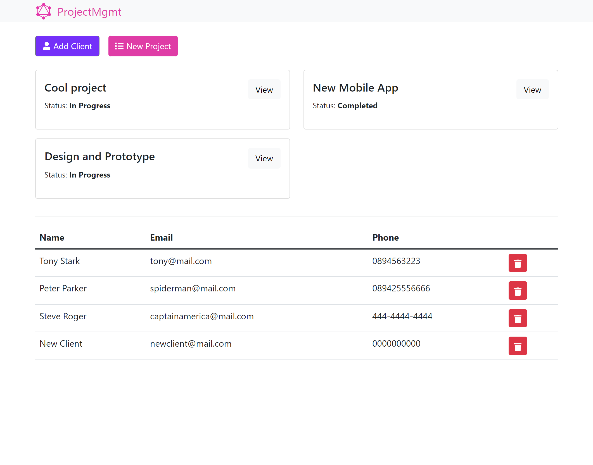

# Project Management - full-stack project management system

### Screenshot

### Built with

- [ReactJs](https://reactjs.org/) - A JavaScript library for building user interfaces
- [GraphQL](https://graphql.org/) - For API
- [Apollo](https://www.apollographql.com/) - A communication layer for manage the flow of data between application clients and your backend
- [MongoDB](https://www.mongodb.com/) - database
